# **Rufus**

- [Le Laboratoire](./Docs.md)

Lien de téléchargement :
- [Lien](https://rufus.ie/fr/) - site source
- [Lien](https://lecrabeinfo.net/telecharger/rufus/) - version inconnu

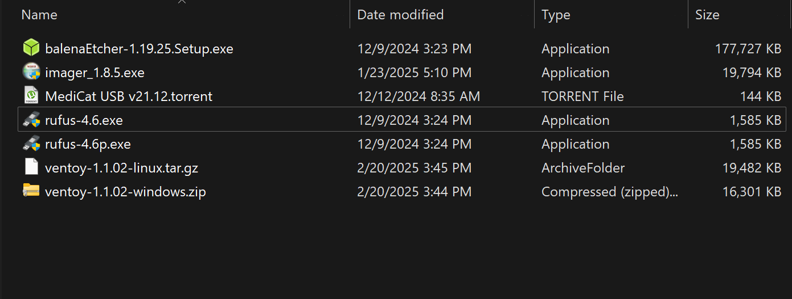
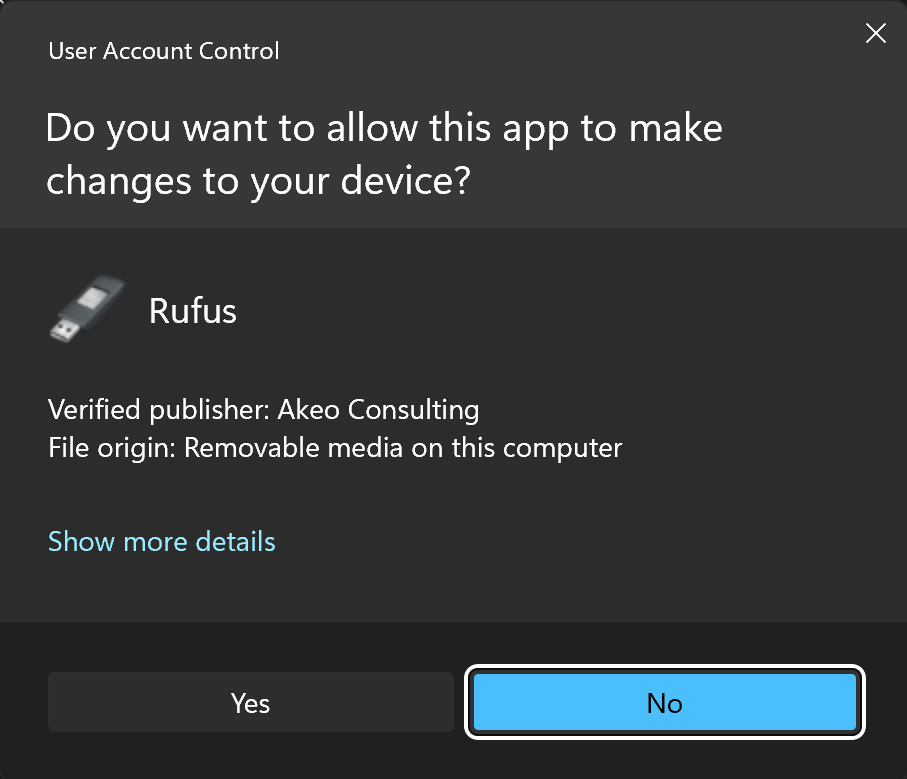
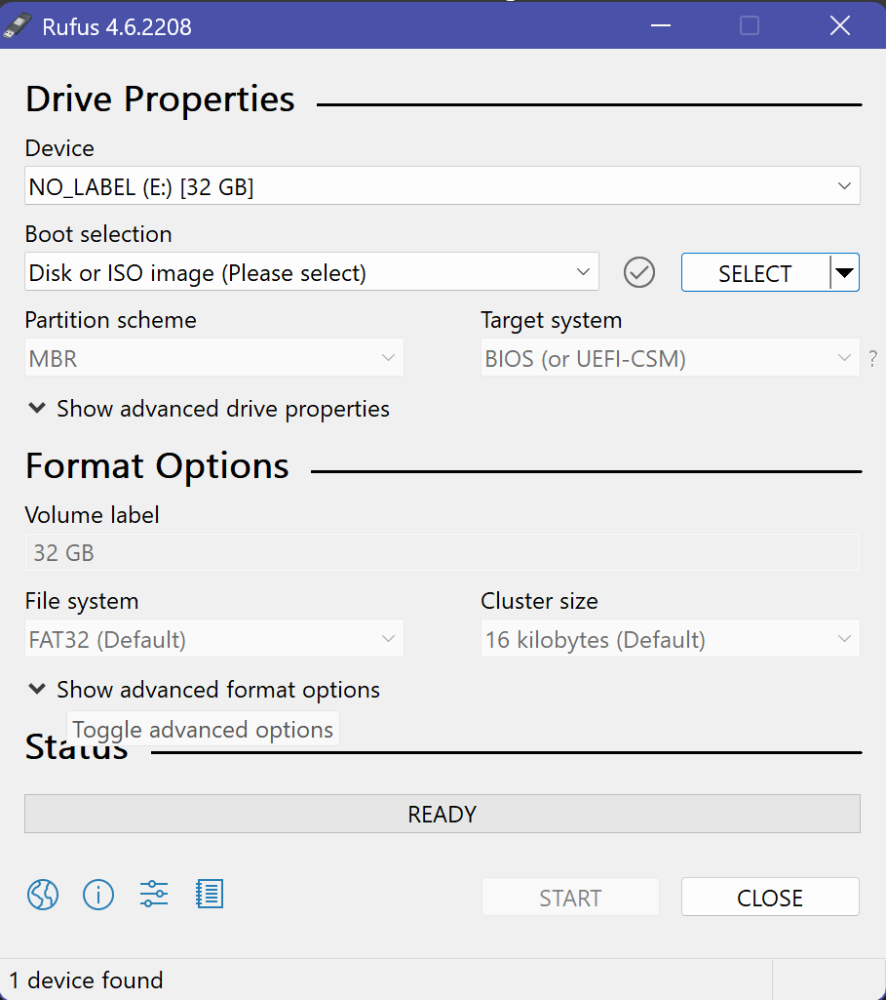
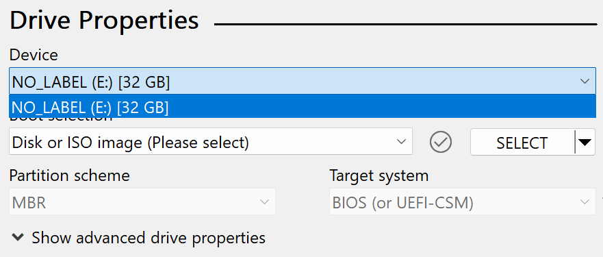
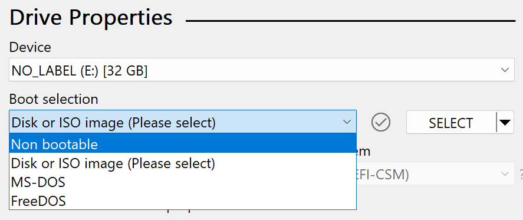
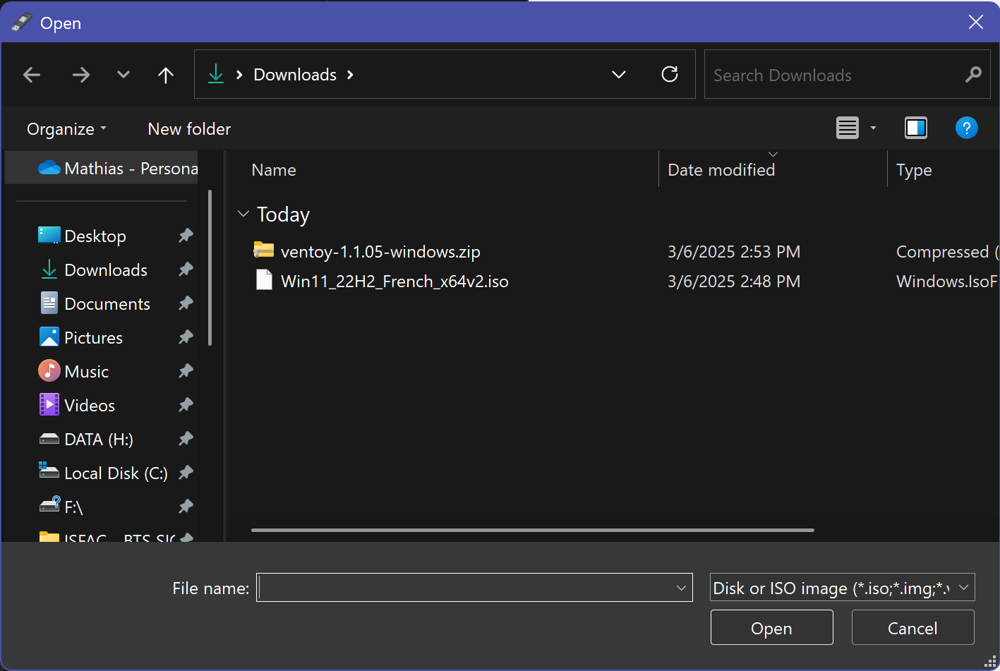
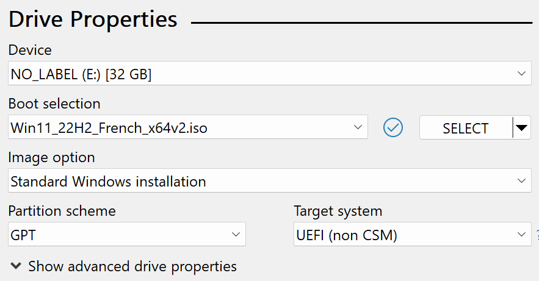
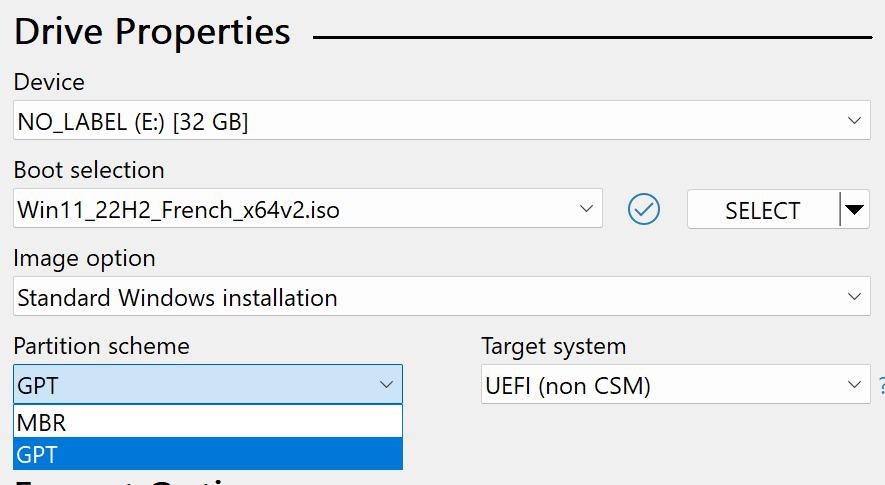
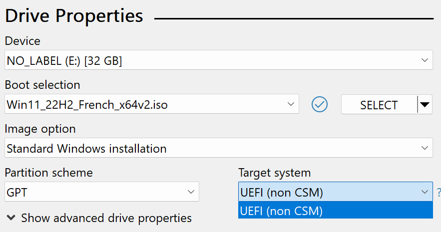
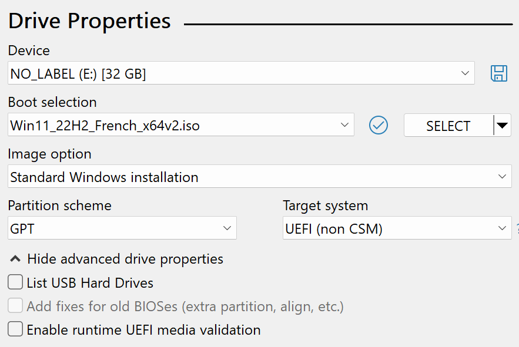
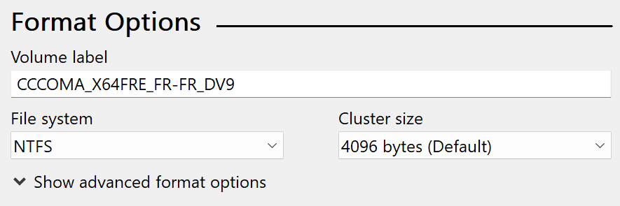
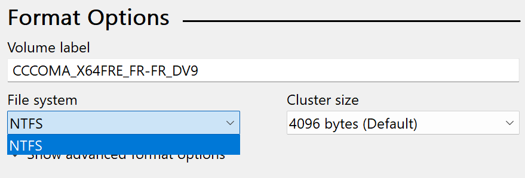
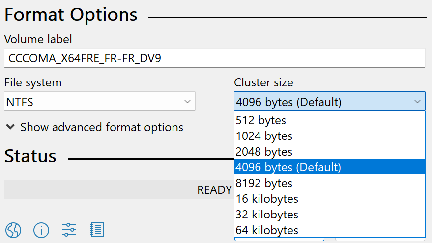
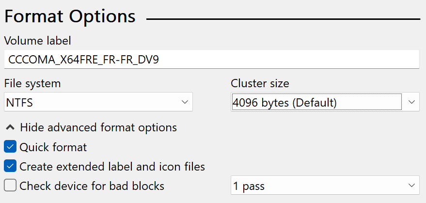
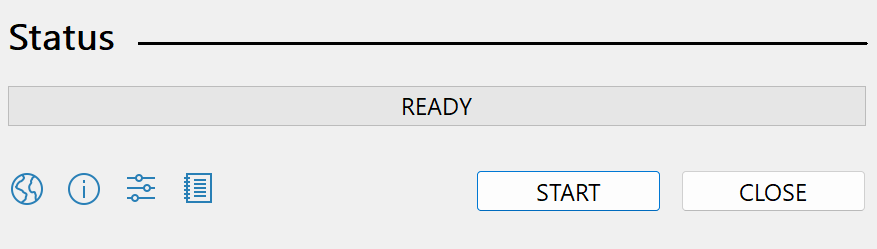
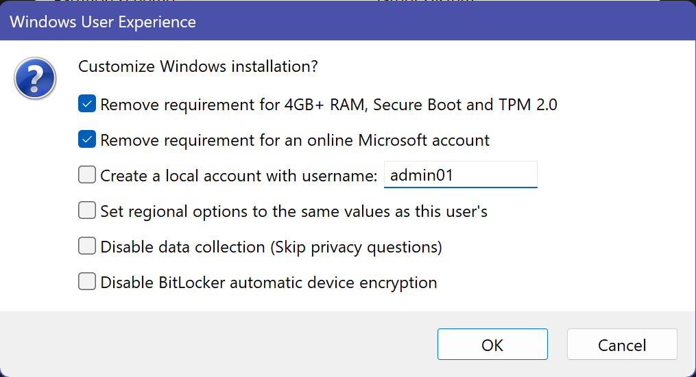
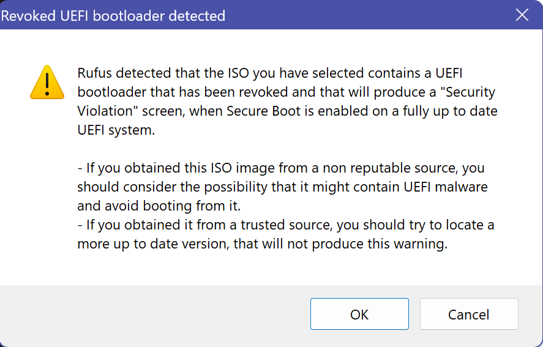
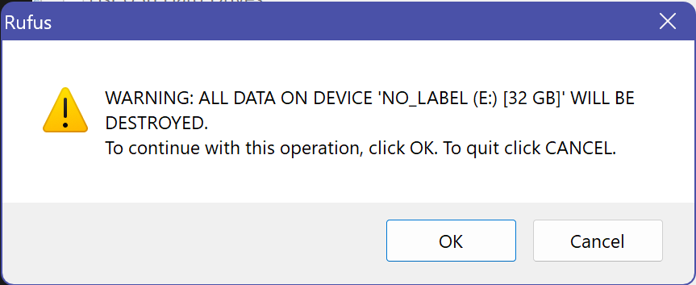
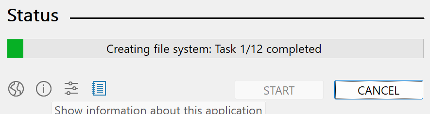
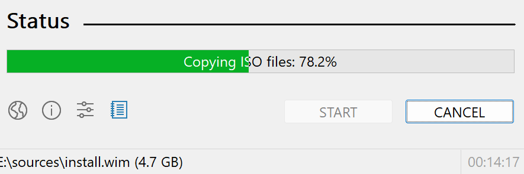
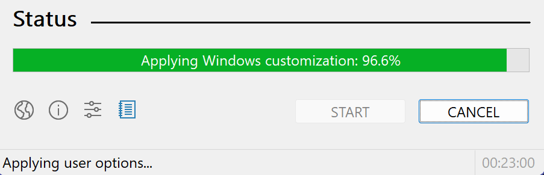
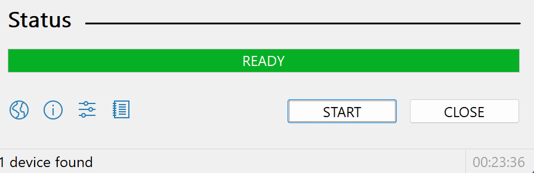
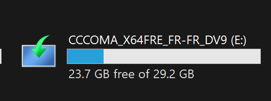
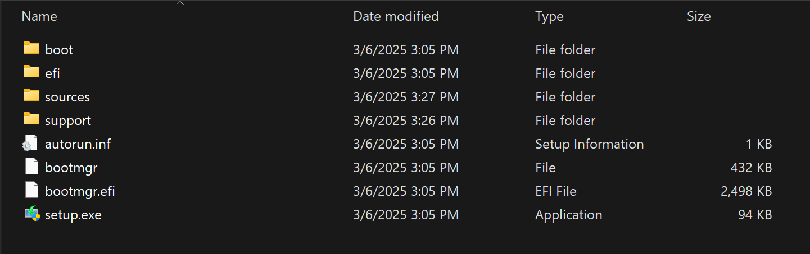